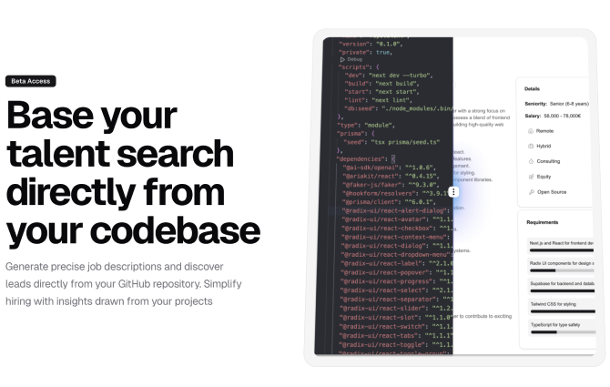

	<h1 align="center"><b>Repotalent</b></h1>

    Job Description Generator and Lead Finder
     
     
    ·
    <a href="https://repotalent.com">Website</a>
    ·
    <a href="https://github.com/johanmic/repotalent/issues">Issues</a>
  

## About Repotalent

Repotalent is a platform from creating job descriptions and finding leads.
Generate a job description from a package.json file, and it will automatically dig through all your repos to find contributors from github to reach out to.

## Features

**Job Description Generator**: Automatically generates detailed technical job descriptions from your project files (package.json, requirements.txt, etc.). 
**Rich Job Post Editor**: Fine-tune auto-generated job descriptions and export them to markdown or PDF format. 
**Smart Lead Finder**: Scans your package dependencies to source qualified candidates from GitHub based on their open-source contributions. 
**Job Board Integration**: Your job postings are automatically listed on our specialized tech job board. 
**Advanced Search**: Find developers by location, programming languages, libraries, and more. 
**Candidate Verification**: Confirms "hireable" status and validates candidate availability. 

## Key Benefits

- Generate Hundreds of qualified leads from a single package.json/requirements.txt/etc file
- Smart search functionality for precise candidate matching
- SEO-optimized job board for maximum visibility
- Automated technical requirement extraction
- Real-time job description editing and collaboration

## App Architecture

- React
- TypeScript
- Next.js 15
- TailwindCSS
- Shadcn
- Trigger.dev
- Supabase
- Vercel

(the usual suspects)

## Get Started

Visit our [documentation](GettingStarted.md) to get started with Repotalent.

## License

This project is licensed under the **[AGPL-3.0](https://opensource.org/licenses/AGPL-3.0)** for non-commercial use.

### Commercial Use

For commercial use or custom deployments, please contact us at [support@repotalent.com](mailto:support@repotalent.com).

By using this software, you agree to the terms of the license.

## Contributing

Contributions are welcome! Please see the [CONTRIBUTING.md](CONTRIBUTING.md) file for more information.

## Roadmap

- [ ] Application System on the platform
- [ ] AI Intro Writer to Contributors
- [ ] Smarter recommendation system for leads
- [ ] CSV Export for leads
- [ ] Small outreach CRM system
- [ ] SEO
- [ ] Email (resend.com)
